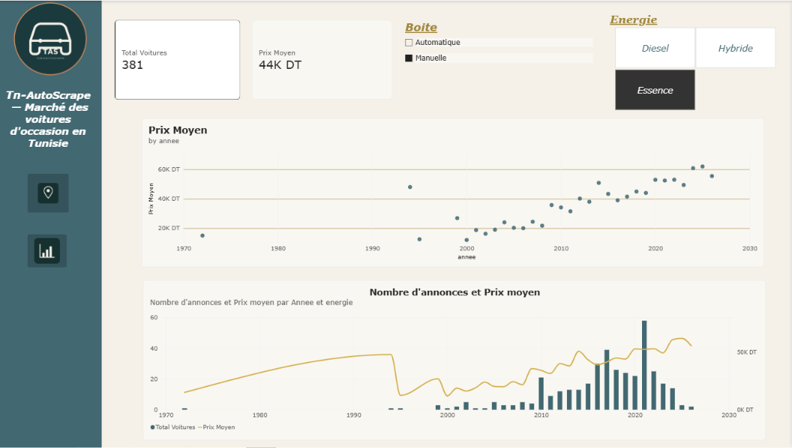
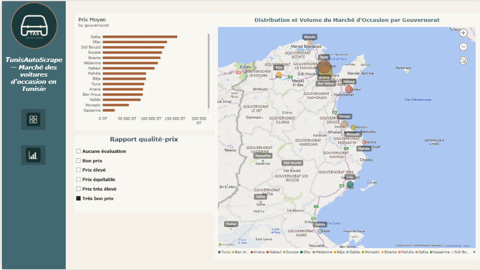
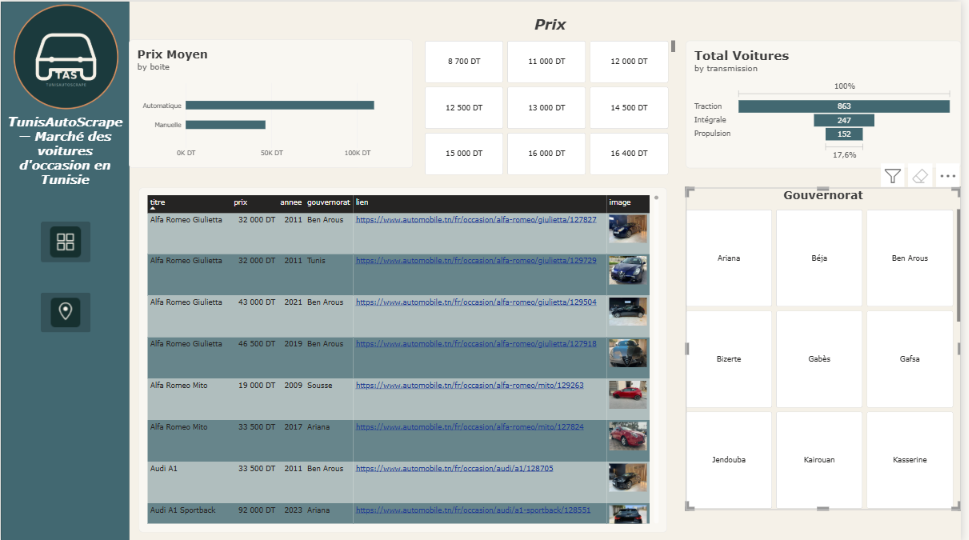

# Tn-AutoScrape


**Marché des voitures d'occasion en Tunisie — scraping, base de données & dashboard Power BI**

TunisAutoScrape collecte automatiquement les annonces de voitures d'occasion publiées sur [automobile.tn](https://www.automobile.tn), les stocke dans une base SQL Server, puis les visualise dans un dashboard Power BI interactif : prix, énergie, kilométrage, puissance, boîte, et répartition par gouvernorat.

---

## 📊 Aperçu du dashboard

### Vue d'ensemble


### Analyse géographique


### Analyse des prix


> 🎬 Une démo animée des filtres interactifs (énergie, boîte, gouvernorat) est disponible dans `screenshots/demo.gif`.

---

## ⚙️ Fonctionnement

Le projet se déroule en 3 étapes :

1. **Scraping** — Un spider Scrapy parcourt les pages d'annonces d'automobile.tn (avec pagination automatique) et suit chaque annonce individuellement pour en extraire le gouvernorat.
2. **Nettoyage & stockage** — Un pipeline nettoie les champs (prix, kilométrage, encodage des accents) puis insère chaque annonce dans une table SQL Server, en ignorant les doublons.
3. **Visualisation** — Power BI se connecte à la base et affiche les données sous forme de dashboard multi-pages.

---

## 🗂️ Structure du projet

```
tunisautoscrape/
├── carscrapper/
│   ├── carspider.py       # Spider principal (pagination + détail annonce)
│   ├── items.py           # Structure des champs extraits
│   ├── pipelines.py       # Nettoyage des données + insertion SQL Server
│   ├── middlewares.py     # Middlewares Scrapy par défaut
│   ├── settings.py        # Configuration du spider (délais, headers, feeds)
│   └── scrapy.cfg         # Config Scrapy
├── power-bi/
│   └── tunisautoscrape.pbix    # Dashboard Power BI
├── screenshots/
│   ├── page1-overview.png
│   ├── page2-geography.png
│   ├── page3-prix.png
│   └── demo.gif
└── README.md
```

---

## 🧰 Stack technique

| Étape | Outils |
|---|---|
| Scraping | Python, Scrapy |
| Nettoyage des données | Scrapy Pipelines, regex |
| Stockage | SQL Server (pyodbc) |
| Visualisation | Power BI Desktop |

---

## 📦 Champs collectés

`titre`, `prix`, `année`, `kilométrage`, `boîte`, `énergie`, `puissance`, `transmission`, `gouvernorat`, `cote` (évaluation du prix), `lien` (annonce originale), `image`

---

## 🚀 Lancer le scraper

```bash
# Créer et activer l'environnement virtuel
python -m venv venv
venv\Scripts\activate      # Windows

# Installer les dépendances
pip install scrapy pyodbc

# Lancer le spider
cd carscrapper
python carspider.py
```

> ⚠️ Le scraper respecte un délai entre les requêtes (`DOWNLOAD_DELAY`) pour ne pas surcharger le serveur. Adapte `SQLSERVER_HOST` / `SQLSERVER_DB` dans `settings.py` à ton propre environnement avant de lancer.

---

## 📈 Ouvrir le dashboard

Ouvre `power-bi/tunisautoscrape.pbix` avec [Power BI Desktop](https://powerbi.microsoft.com/desktop/) et connecte-le à ta base SQL Server locale.

---

## ✍️ Auteure

Projet réalisé par **Loujein** — étudiante en cycle ingénieur à l'ENSI (Tunisie).
